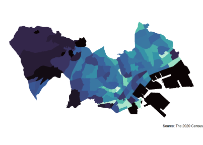

# Rによる地理空間データの可視化
<b>作成者</b>：<a href="https://shinichiro-iwata.github.io/">岩田真一郎</a>（神奈川大学経済学部）
 <b>目的</b>：Rを用いて地理空間データを地図上に示すこと
 <b>対象</b>：主に大学生（卒業研究，ゼミナールにおける研究）
 <b>ウェブサイト<b>：https://shinichiro-iwata.github.io/geospatial-data-visualization/
 
<ul>1.　<A href="https://shinichiro-iwata.github.io/geospatial-data-visualization/prefecture-level-data-visualization.html">
  都道府県別データによる人口の可視化</A>
   &emsp; 1.1　
    <A href="https://shinichiro-iwata.github.io/geospatial-data-visualization/pld1-visualization.html">追加データの可視化</a>
     &emsp; 1.2　
      <A href="https://shinichiro-iwata.github.io/geospatial-data-visualization/pld2-visualization.html">自作データの可視化</a>
       &emsp; 1.3　
        <A href="https://shinichiro-iwata.github.io/geospatial-data-visualization/logarithmic-transformation-visualization.html">対数による可視化</a>
 &emsp; 1.4　
        <A href="https://shinichiro-iwata.github.io/geospatial-data-visualization/pld3-visualization.html">
          ジオメトリの移動による日本地図の可視化</a> ←（北海道・沖縄県の位置移動）
 &emsp; 1.5　
        <A href="https://shinichiro-iwata.github.io/geospatial-data-visualization/rigional-data-visualization.html">
          地方区分データの可視化</a></ul>
      <ul>2.　<A href="https://shinichiro-iwata.github.io/geospatial-data-visualization/grid-data-visualization.html">
  地域メッシュ統計による人口密度の可視化</A>
   &emsp; 2.1　
    <A href="https://shinichiro-iwata.github.io/geospatial-data-visualization/community-bus-visualization.html">コミュニティバス路線上の人口密度の可視化</A>
     &emsp; 2.2　
      <A href="https://shinichiro-iwata.github.io/geospatial-data-visualization/economic-census-visualization.html">OpenStreetMapを背景にした情報通信業事業所数の可視化</A>
　　　　 &emsp; 2.3　
      <A href="https://shinichiro-iwata.github.io/geospatial-data-visualization/land-use-subdivision-mesh-visualization.html">土地利用細分メッシュデータによる土地利用状況の可視化</A>
       &emsp; 2.4　
        <A href="https://shinichiro-iwata.github.io/geospatial-data-visualization/shop-periphery-visualization.html">商圏内の地域メッシュデータの可視化</A>
       &emsp; 2.5　
        <A href="https://shinichiro-iwata.github.io/geospatial-data-visualization/hexbin-map-visualization.html">六角形マップによる人口密度の可視化</A>
          &emsp; 2.6　
        <A href="https://shinichiro-iwata.github.io/geospatial-data-visualization/elevation-slope-visualization.html">標高・傾斜度メッシュデータの可視化</A>
      </ul>
<ul>3.　<A href="https://shinichiro-iwata.github.io/geospatial-data-visualization/census-block-data-visualization.html">
  小地域統計による人口の可視化</A>
   &emsp; 3.1　
    <A href="https://shinichiro-iwata.github.io/geospatial-data-visualization/cbd1-visualization.html">小地域統計による人口変化の可視化</A>
　　 &emsp; 3.2　
     <A href="https://shinichiro-iwata.github.io/geospatial-data-visualization/cbd2-visualization.html">小地域数が変更した場合の人口変化の可視化</A></ul>
  <ul>4.　<A href="https://shinichiro-iwata.github.io/geospatial-data-visualization/point-data-visualization.html">
       ポイントデータによる地価の可視化</A>
   &emsp; 4.1　
    <A href="https://shinichiro-iwata.github.io/geospatial-data-visualization/bubble-map-visualization.html">バブルマップによる地価の可視化</a>
     &emsp; 4.2　
      <A href="https://shinichiro-iwata.github.io/geospatial-data-visualization/compactcity-network-visualization.html">立地適正化計画区域内の地価の可視化</a>
       &emsp; 4.3　
        <A href="https://shinichiro-iwata.github.io/geospatial-data-visualization/spatial-interpolation.html">空間内挿による地価の可視化</a>
         &emsp; 4.4　
          <A href="https://shinichiro-iwata.github.io/geospatial-data-visualization/3D-visualization.html">3Dマップによる地価の可視化</a>
           &emsp; 4.5　
          <A href="https://shinichiro-iwata.github.io/geospatial-data-visualization/prefecture-lp-visualization.html">都道府県地価調査データによる地価の可視化</a>
             &emsp; 4.6　<A href="https://shinichiro-iwata.github.io/geospatial-data-visualization/open-data-visualization.html">
              オープンデータによる商店街通行量の可視化</A>
               &emsp; 4.7　<A href="https://shinichiro-iwata.github.io/geospatial-data-visualization/crime-data-visualization.html">
                ジオコーディングによる犯罪発生情報の可視化</A></ul>
<ul>5.　<A href="https://shinichiro-iwata.github.io/geospatial-data-visualization/municipality-data-visualization.html">
       市区町村データによる大学・大学院卒者割合の可視化</A>
    &emsp; 5.1　<A href="https://shinichiro-iwata.github.io/geospatial-data-visualization/crime-data-count.html">
  市区町村別犯罪数の計算と可視化</A></ul>
<ul>6.　<A href="https://shinichiro-iwata.github.io/geospatial-data-visualization/DID-data-visualization.html">
       人口集中地区データによる郊外化の可視化</A>
    &emsp; 6.1　<A href="https://shinichiro-iwata.github.io/geospatial-data-visualization/DID-pop-visualization.html">
  人口集中地区データによる人口分布の可視化</A></ul>
<ul>7.　<A href="https://shinichiro-iwata.github.io/geospatial-data-visualization/rnaturalearth-visualization.html">
  Natural Earthの地理空間データの可視化</A>
    &emsp; 7.1　<A href="https://shinichiro-iwata.github.io/geospatial-data-visualization/WDI-visualization.html">
  世界銀行のオープンデータによる平均寿命・出生率の可視化</A></ul>
<ul>8.　<A href="https://shinichiro-iwata.github.io/geospatial-data-visualization/interactive-map-visualization.html">
インタラクティブマップによる地理空間データの可視化</A>
    &emsp; 8.1　<A href="https://shinichiro-iwata.github.io/geospatial-data-visualization/OECD-visualization.html">地物周辺の地理空間データの可視化</A>←（周辺統計量の計算）
 &emsp; 8.2　<A href="https://shinichiro-iwata.github.io/geospatial-data-visualization/street-shop-visualization.html"> 
OSMデータによる商店街の可視化</A></ul>
<ul>9.　<A href="https://shinichiro-iwata.github.io/geospatial-data-visualization/DID-data-animation.html">
アニメーションによる地理空間データの可視化</A>
    &emsp; 9.1　<A href="https://shinichiro-iwata.github.io/geospatial-data-visualization/OECD-visualization.html">OECDデータによる住宅価格の可視化</A></ul>
<ul>10.　<A href="https://shinichiro-iwata.github.io/geospatial-data-visualization/raster-elevation-visualization.html">
ラスターデータによる標高の可視化</A>←（陰影表現）</ul>
 
